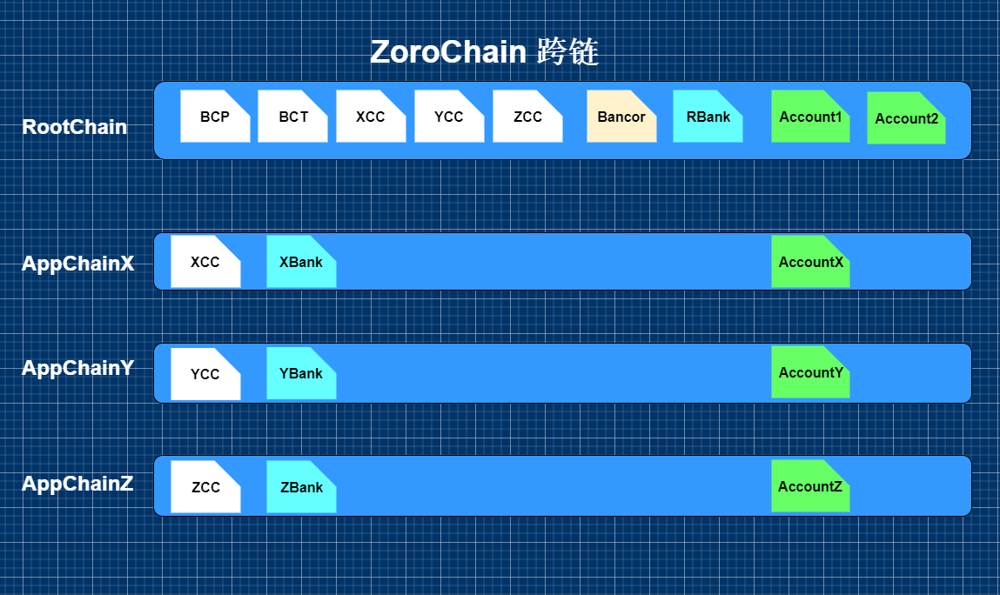

# 跨链实现
目前 NEO 和 Zoro 间的跨链通信(转账)通过智能合约存取资产和第三方管理程序转发交易来实现，因为 NEO 已经运行无法修改，只能依靠其现有机制来实现，但是这种方式全部依赖管理程序，安全性不够而且完全受中心化控制。

Zoro 目前还处在设计开发中，所以根链和应用链之间可以设计其他的跨链方案。

主要考虑因素：
* 保证跨链交易的原子性，要保证跨链双方都交易成功/失败；
* 一条链可以对另一条链的交易进行验证，B 链可以验证 A 链的一笔交易，验证通过后才可以在 B 链做相应的交易；
* 保证两条链的资产总量不变，A 转移一笔资产到 B 链，A 链资产减少，B 链对应资产增加；
* 两条链独立安全，一条链受到攻击时不影响与之通信的另一条链；

目前考虑的方案有以下几种：

1、沿用 NEO 和 Zoro 的跨链方案；A 链上往特定合约地址转一笔资产，产生 ApplicationLog，第三方管理程序监控 A 的区块数据，发现这笔转账后往 B 上发起一笔交易，实现跨链通信，这样交易的验证都通过管理程序完成，需要考虑安全性；收取钱的交易也是管理程序去签名，完全中心化。

2、1 的改进版，先实现跨链读取数据，这样管理程序只做监控和发起交易，跨链交易的验证部分由合约完成，不需要固定的管理者签名，安全性和去中心化都有所提升，但需要保证验证交易时目标链的高度一致（状态一致）。A 链上发起一笔到 B 链的转账，监控程序看到后转发给 B 链，B 链读取验证 A 链的该笔交易信息，做出相应的处理，需要考虑的是如何保证 B 链的每个节点去 A 链读取数据时，它请求的 A 链节点区块已经包含了该笔交易，如果高度还没到时则需要等待，如何设置等待机制？

3、通过投递的方式，应用链间的跨链都通过与根链交互来实现，投递由共识机制来发起一笔交易实现，先在 A 链上发起一笔跨链交易，A 链的共识机制确认该交易后便往根链发一笔交易，C 链监控到了根链的这笔交易后就由共识机制往 C 链发一笔交易，完成跨链，该方案需要所有应用链都自带监控根链的功能，并且在共识部分实现发起交易的功能。

# 细化方案
## 业务：

根链有 BCP，每个应用链有自己的代币，应用链发行的代币需要实现跨链的话必须在根链发布映射代币合约，根链上映射代币发到 Bank 中，随着跨链转移再释放（因为 Bancor 交易所运行在根链上），应用链和根链可以直接跨链转账，应用链之间要跨链转账的话需要应用链管理者在对方链上发布相应的代币合约去支持，转账过程通过根链间接来完成；

* 创建应用链的时候会生成一个多签的公私钥对，根链保存公钥，应用链的共识节点保存私钥，多签账户定期更换或者更换共识节点的时候更换;

* 应用链需要有支持往根链跨链交易的交易类型，根链往应用链的跨链交易也需要可以标记往哪一条链跨链。
## 流程：
### 1、AppChainX 上的用户 AccountX 要将他在 AppChainX 上的 XCC 跨链转到 RootChain 上的 Account2 账户中：
* AccountX 先在 AppChainX 上发起一笔交易，将 XCC 存到 AppChainX 上的 XBank 中；
* AppChainX 的共识机制在验证该交易后便往根链发一笔交易，这笔交易需要共识节点的多签私钥签名，签名数量达到达成共识数量即可，根链根据该笔交易往根链对应账户账户转一笔 XCC；

### 2、根链上的用户 Account1 要将他在根链上的 YCC 转到 AppChainY 上的 AccountY 账户里：
* Account1 先在根链上发起一笔交易，将根链 YCC 存到 RBank 中；
* AppChainY 的共识机制会监控根链数据，发现根链有 YCC 转到 RBank 的交易，则当做跨链处理，便向 AppChainY 发起一笔交易，从 YBank 中转出一笔 YCC 给指定的账户 AccountY。

